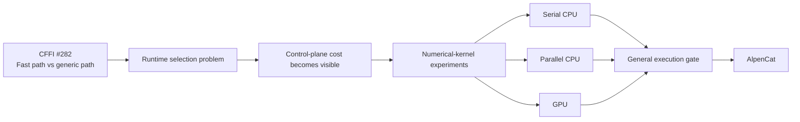
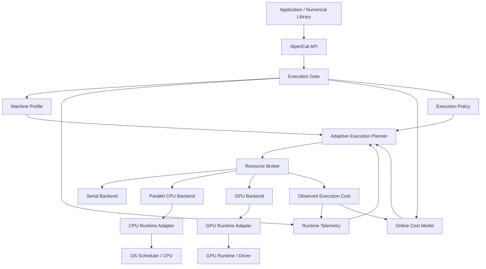
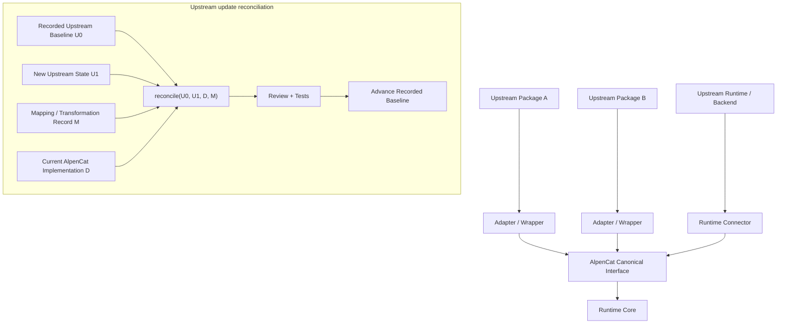

# AlpenCat

**Adaptive Execution Runtime**

> **Status: Experimental — v0.1.0**
>
> AlpenCat's first complete runtime architecture is implemented and under active
> validation. APIs, configuration surfaces, backend behavior, and performance
> characteristics may change before v1.0.
>
> It is not yet recommended for production-critical workloads.
>
> Contributions, benchmarks, portability testing, bug reports, and design
> feedback are welcome.

AlpenCat is a lightweight execution-control runtime for choosing and coordinating
serial CPU, parallel CPU, and GPU execution.

It sits between an application and its execution backends. AlpenCat does **not**
replace the operating-system scheduler. Its job is to decide which admissible
execution path is likely to be profitable, expose work to the selected backend,
observe the result, and improve later decisions.

## The problem

Modern numerical and systems workloads often have several valid implementations:

```text
serial CPU
parallel CPU
GPU / accelerator
specialized fast path
generic fallback
```

Writing a faster kernel is only part of the problem. A caller still needs to
decide **when** that implementation is actually worth using.

That decision can depend on:

- workload size and shape;
- setup and dispatch cost;
- transfer cost;
- machine capabilities;
- current runtime pressure;
- execution budget;
- nested or external parallelism;
- observed performance on the current machine;
- whether the model has enough evidence to make a confident switch.

Hard-coded thresholds are simple, but they become brittle across machines and
workloads. Re-evaluating every tiny operation is also wrong when the control
plane costs more than the dataplane.

AlpenCat isolates that problem into a reusable execution layer.

```text
application / library
        ↓
     AlpenCat
        ↓
observe → estimate → choose → execute → learn
        ↓
serial / parallel CPU / GPU
```

## Origin

AlpenCat grew out of practical open-source optimization work rather than an
attempt to design a scheduler from scratch.

The initial idea emerged while working on
[python-cffi/cffi#282](https://github.com/python-cffi/cffi/pull/282), an
optimization for fixed-signature CFFI function-pointer calls.

That work introduced a conservative split:

```text
known, proven scalar case
    → specialized fast path

everything else
    → existing generic implementation
```

A runtime-calibrated selector was also explored during development. It worked
experimentally, but exposed a broader problem: runtime decisions have their own
cost. For nanosecond-scale operations, timing, synchronization, state, and
selection can become more expensive than the work being optimized.

The question shifted from:

> How do we make this particular call path faster?

to:

> How can a system choose among multiple valid execution paths without making
> the control plane more expensive than the dataplane?

Later numerical-kernel work, including experiments around
`scipy.signal.upfirdn`, expanded the same question from fast-path vs generic
fallback to heterogeneous execution across optimized serial CPU, parallel CPU,
and GPU implementations.



AlpenCat is the abstraction that emerged from separating that execution-control
problem from any single library or kernel.

## Architecture



The layers are intentionally separate:

- **Execution gate** — decides which backend is admissible and economically
  sensible.
- **Planner / broker** — turns that decision into work units and budgets.
- **Runtime adapters** — expose work to existing CPU/GPU runtime mechanisms.
- **OS / driver** — performs actual hardware scheduling.

AlpenCat does not attempt to manually place threads on CPU cores or replace a
mature operating-system scheduler.

## Package structure

Current workspace crates:

| Crate | Role |
| --- | --- |
| `runtime-api` | caller-facing API and runtime orchestration |
| `runtime-core` | backend-neutral primitives |
| `runtime-selector` | backend selection |
| `runtime-cpu-rayon` | parallel CPU adapter |
| `runtime-gpu-wgpu` | GPU adapter |
| `runtime-machine` | machine/capability discovery |
| `runtime-telemetry` | runtime observations |
| `runtime-planner` | work-unit planning |
| `runtime-broker` | dynamic resource brokerage |
| `runtime-cost-model` | learned execution-cost model |
| `runtime-execution-planner` | adaptive execution-plan synthesis |
| `runtime-policy-cache` | cached control-plane decisions |
| `runtime-rebalancer` | continuous replanning/rebalance triggers |
| `runtime-integration` | integration/migration layer |
| `runtime-cffi-bridge` | C FFI integration surface |

The public abstraction is designed so backend-specific implementation types do
not leak into callers.

## Dependency, wrapper, and update model

AlpenCat treats external runtimes and packages as replaceable implementation
inputs rather than as the architecture itself.



The repository records:

```text
U0 = imported upstream baseline
U1 = later upstream state
D  = transformed downstream implementation
M  = dedup / override / wrapper / replacement map
```

An upstream update is reviewed as `reconcile(U0, U1, D, M)`, rather than as a
blind dependency bump.

This allows AlpenCat to progressively replace or internalize critical runtime
functionality without losing provenance or silently duplicating upstream logic.

## v0.1.0 capabilities

The v0.1 architecture includes:

- generic task/backend registration;
- serial/reference execution;
- bounded and reusable Rayon CPU pools;
- wgpu-backed GPU execution proof path;
- execution budgets;
- nested-Rayon protection;
- explicit host-declared external-parallelism protection;
- machine and GPU capability discovery;
- runtime telemetry;
- work-unit planning;
- dynamic resource brokerage;
- cached execution policies for ultra-hot/tiny operations;
- online machine-aware cost estimation;
- setup / per-item / transfer cost separation;
- local residual correction;
- uncertainty-aware backend selection;
- hysteresis for backend stability;
- adaptive execution planning;
- continuous rebalancing triggers;
- integration/migration support;
- C FFI bridge;
- upstream dependency/reconciliation ledgers.

The current workspace version is `0.1.0`, Rust MSRV is 1.87, and package
publication remains disabled while the public interface is experimental.

## Validation snapshot

Latest M12 v2.1 validation is recorded in
[`docs/M12_V21_VALIDATION_2026-10-02.md`](./docs/M12_V21_VALIDATION_2026-10-02.md).

At commit `eca250d2e9ab8d04e2483d4e9049a5d0f870953a`:

- Rust workspace tests and doctests: **108 PASS**;
- cost-model release suite: **13/13 PASS**;
- formatting and Clippy with warnings denied: **PASS**;
- dependency/reconciliation validators: **PASS**;
- software Vulkan correctness checks: **PASS**;
- synthetic CPU/GPU economic crossover: **22,500 items exactly recovered**;
- Apple M5 FIR numeric checks: **15/15 PASS**;
- Apple M5 observed-shape model replay: **15/15**;
- leave-one-size-out validation: **13/15**.

The Apple M5 FIR harness is reconstructed. Its measurements are useful as
current evidence, but are not an exact A/B comparison with the lost historical
temporary harness.

The FIR measurements are replayed through AlpenCat's Rust cost model; they are
not yet an end-to-end live Metal FIR Runtime-adapter test.

## Current limitations

v0.1.0 is intentionally experimental.

Known boundaries include:

- APIs and configuration surfaces may change before v1.0;
- cold/unseen workload sizes have less evidence than observed buckets;
- external OpenMP / BLAS / Python thread-pool coordination is host-declared,
  not automatically controlled by the core;
- GPU portability and performance evidence is not yet comprehensive across
  hardware vendors;
- the Apple FIR validation is not a live Metal adapter integration;
- production-critical stability guarantees have not been defined;
- public package licensing and publication metadata must be finalized before a
  public release.

These are validation and productization boundaries, not reasons to reopen the
completed v0.1 scheduler architecture.

## Roadmap

### v0.1 — architecture-complete experimental runtime

- serial / parallel CPU / GPU execution;
- machine discovery and telemetry;
- adaptive cost model and planning;
- resource brokerage and rebalancing;
- nested-parallelism safeguards;
- integration bridge and provenance model.

### Near term

- broaden real-world workload integrations;
- validate more Intel, AMD, Apple Silicon, and GPU environments;
- strengthen cold-start/generalization evidence;
- reduce and clarify the public integration surface;
- complete release packaging, examples, and licensing;
- keep architecture changes evidence-driven rather than milestone-driven.

### Long term

AlpenCat aims to minimize **mandatory** dependencies and progressively move
critical execution-control functionality into a small, self-contained Rust/C
core.

The intended direction is:

```text
small Rust/C core
    +
stable backend-neutral interface
    +
optional runtime / accelerator adapters
```

This does not imply eliminating operating-system, driver, or accelerator APIs.
Backend-specific dependencies should remain optional and isolated behind
connectors wherever practical.

## Contributing

Contributions are welcome, especially:

- Linux / macOS / Windows portability testing;
- Intel / AMD / Apple Silicon benchmark evidence;
- CPU/GPU crossover measurements;
- reproducible performance or correctness bugs;
- external-runtime interoperability tests;
- backend adapters;
- documentation and examples.

Before proposing any of the following, please open a design discussion first:

- a new scheduler architecture;
- a new mandatory dependency;
- hardware-specific hard-coded policy thresholds;
- a broad public API redesign.

See [`CONTRIBUTING.md`](./CONTRIBUTING.md).

## Project status and versioning

```text
v0.1.x
  architecture complete
  experimental validation and integration

v0.2+
  evidence-driven integrations and refinements

v1.0
  documented public API stability
  supported-platform contract
  explicit production-readiness criteria
```

No roadmap item is a promise to add complexity. A feature should enter the core
only when evidence shows that the simpler architecture is insufficient.

## Documentation

Key records:

- [Resource Control Center roadmap](./docs/RESOURCE_CONTROL_CENTER_ROADMAP.md)
- [Final architecture QC](./docs/FINAL_ARCHITECTURE_QC_2026-10-01.md)
- [M12 v2.1 validation](./docs/M12_V21_VALIDATION_2026-10-02.md)
- [External runtime interoperability](./docs/EXTERNAL_RUNTIME_INTEROPERABILITY.md)
- [Upstream reconciliation model](./docs/UPSTREAM_RECONCILIATION_MODEL.md)
- [Upstream dependency map](./docs/UPSTREAM_DEPENDENCY_MAP.md)

Historical milestone documents remain under `docs/` as implementation and
validation evidence; they are not the primary onboarding path.

## License

A public OSS license has **not yet been selected**. This repository remains in
pre-public-release validation. License selection is a release blocker and must
be completed before accepting external code contributions under a public
release.
